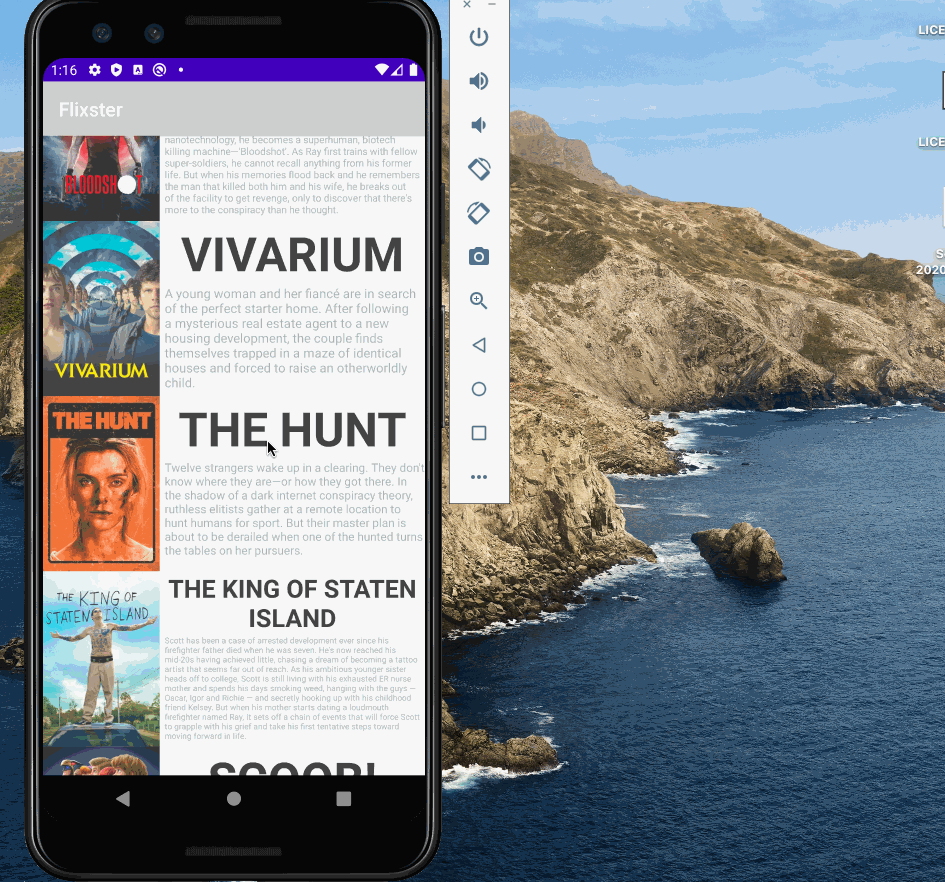

# Project 1 - Flixster

Flixtser is a basic read-only movie listing app using the Movie Database API.

Submitted by: Marc Mapeke

Time spent: 18 hours spent in total

## User Stories

The following **required** functionality is completed:

* [x] User can view a list of movies (title, poster image, and overview) currently playing in theaters from the Movie Database API.
* [x] User can see a graphic and some information about currently playing movies
* [x] User should see responsive views for both landscape/portrait mode
* [x] User can select a movie to expose more details

The following **stretch** features are implemented:

* [x] Add rounded corners for the images using the Glide transformations 
* [x] Improve the user interface
* [ ] Apply the View Binding Library to reduce view boilerplate
* [ ] Allow video posts to be played in full-screen using YoutubePlayerView

## Video Walkthrough

Here's a walkthrough of implemented user stories:

GIF created with [LiceCap](http://www.cockos.com/licecap/).

## Notes

Developing a workflow and understanding information about different parts of an Android Applcation to connect various pieces of the activites, models, etc. was difficult
Improving and creating a UI I enjoyed enough was also difficult, especially with carrying changes over quickly between landscape and portait.

## License

    Copyright [2020] [Marc Mapeke]

    Licensed under the Apache License, Version 2.0 (the "License");
    you may not use this file except in compliance with the License.
    You may obtain a copy of the License at

        http://www.apache.org/licenses/LICENSE-2.0

    Unless required by applicable law or agreed to in writing, software
    distributed under the License is distributed on an "AS IS" BASIS,
    WITHOUT WARRANTIES OR CONDITIONS OF ANY KIND, either express or implied.
    See the License for the specific language governing permissions and
    limitations under the License.
